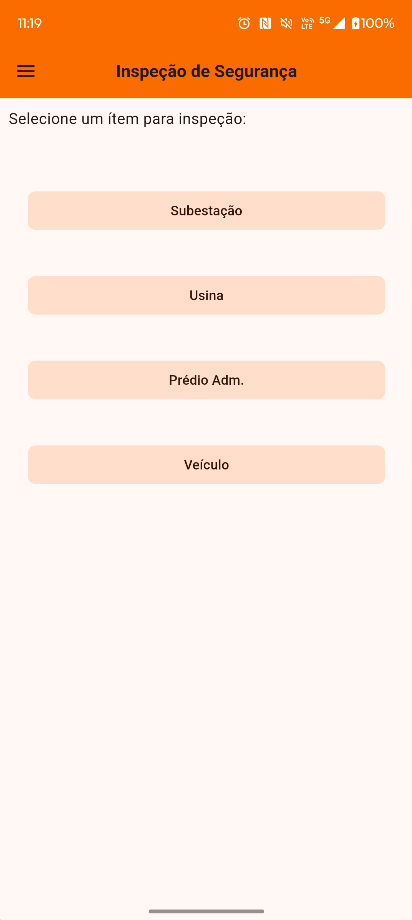
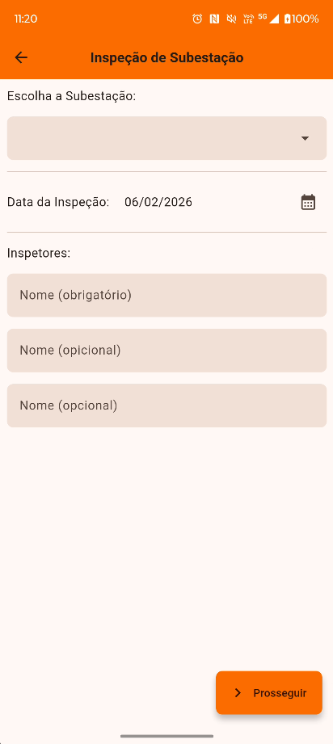
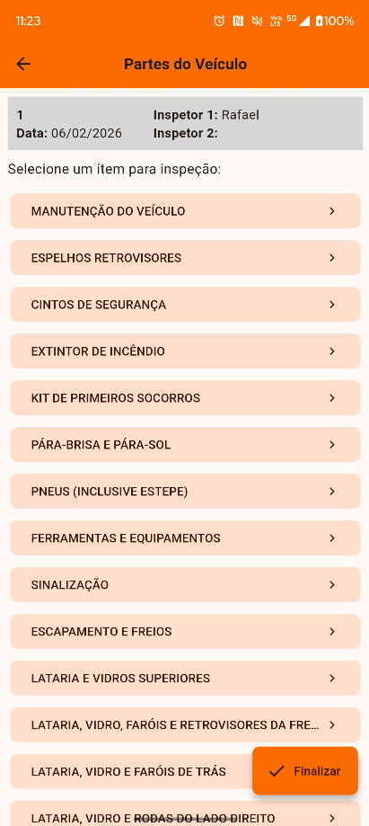
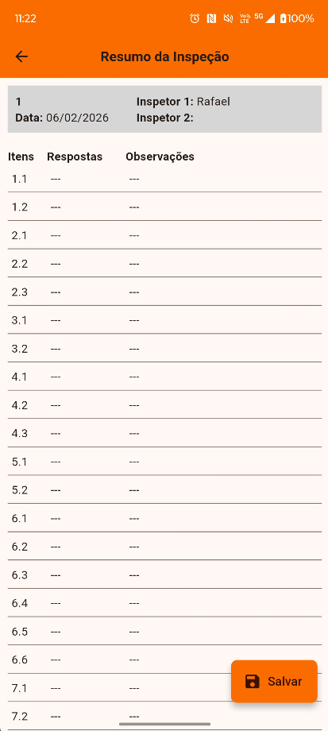

# Inspeção de Segurança CIPA

Modelo MVP de um aplicativo desenvolvido em Flutter para otimização de inspeções de segurança do trabalho e gestão da CIPA. O sistema permite a coleta de dados, preenchimento de listas de verificação (checklists) e a geração automatizada de relatórios.

## Screenshots

  
  &nbsp;&nbsp;
  
  &nbsp;&nbsp;
  
  &nbsp;&nbsp;
  

## Tecnologias Utilizadas

O projeto foi construído utilizando o **Flutter** (SDK ^3.6.1) como framework principal. A arquitetura baseia-se nas seguintes bibliotecas e serviços:

* **Gerenciamento de Estado:** `provider` para o controlo centralizado do estado da aplicação.
* **Persistência de Dados Local:** `sqflite` para a gestão de base de dados SQLite interna.
* **Geração de Relatórios:** `syncfusion_flutter_xlsio` para a criação de planilhas em formato Excel (.xlsx).
* **Comunicação:** `mailer` para o envio de relatórios via protocolo SMTP.
* **Captura e Processamento de Imagens:** `camerawesome` para a interface de câmara e `flutter_image_compress` para otimização de armazenamento.
* **Utilitários:** `flutter_dotenv` para gestão de variáveis de ambiente e `file_picker` para manipulação de ficheiros no sistema.

## Estrutura de Dados

A aplicação opera com um modelo de dados local, garantindo funcionalidade offline para as inspeções de campo.

### Base de Dados Local (SQLite)

A persistência dos dados é gerida através de um banco SQLite inicializado a partir de um ativo pré-configurado (`assets/data.db`). A estrutura lógica organiza-se da seguinte forma:

* **Tabelas de Inspeção:** Segmentadas por módulos operacionais (Subestação, Usina, Prédio, Veículo).
* **Definição de Entidades:**
* **Identificadores de Grupo (`itens_id`):** Categorização macro dos pontos de inspeção.
* **Descrição dos Itens (`itens`):** Detalhe do objeto ou área a ser inspecionada.
* **Pontos de Verificação (`perguntas`):** Critérios específicos de conformidade a serem avaliados pelo inspetor.
